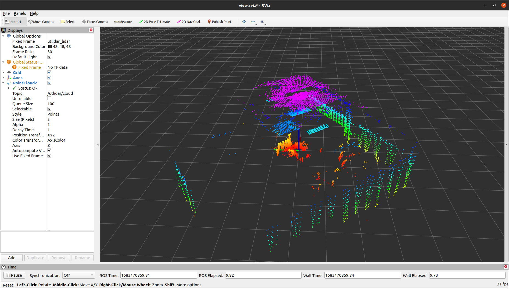
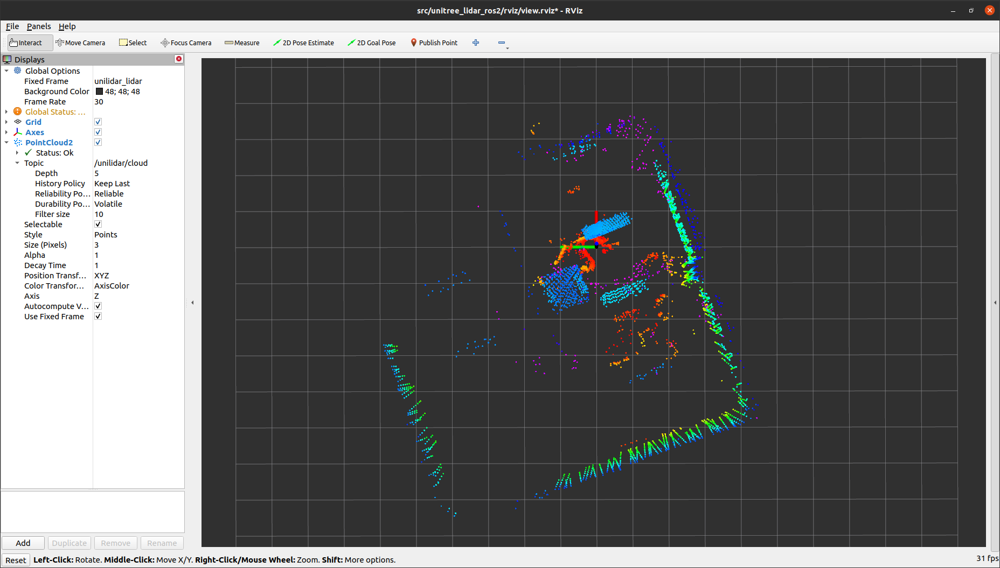

# Unilidar SDK2

## 1. Introduction

This repository is the Software Development Kit (SDK) for the [Unitree L2](https://www.unitree.com/LiDAR) LiDAR.

You can use the code interfaces in this repository to obtain point cloud and IMU data from our LiDAR, as well as set and get relevant configuration parameters of the radar.

We provide several common interfaces for the LiDAR:
- The original C++ based SDK: [unitree_lidar_sdk](./unitree_lidar_sdk/README.md)
- The package for parsing and publishing LiDAR data in the ROS environment: [unitree_lidar_ros](./unitree_lidar_ros/src/unitree_lidar_ros/README.md)
- The package for parsing and publishing LiDAR data in the ROS2 environment: [unitree_lidar_ros2](./unitree_lidar_ros2/src/unitree_lidar_ros2/README.md)

## 2. Coordinate System Definition

<div style="text-align:center">
  
</div>

The coordinate system of this LiDAR is defined as shown in the above figure, which meets the definition of a right-handed coordinate system. Let the LiDAR point cloud coordinate system be $\{L\}$, and the IMU coordinate system be $\{I\}$.

The origin of the LiDAR point cloud coordinate system is located at the center of the bottom mounting surface of the LiDAR. Its +X-axis is opposite to the direction of the bottom cable outlet, its +Y-axis is obtained by rotating the +X-axis counterclockwise by 90 degrees, and its +Z-axis is perpendicular to the bottom surface.

The three coordinate axes of the IMU coordinate system are parallel to the corresponding coordinate axes of the point cloud coordinate system, and the two only have a translation of the origin position. The origin of the IMU coordinate system in the LiDAR point cloud coordinate system is (in meters): [-0.007698, -0.014655, 0.00667].

According to the standard transformation matrix method, the pose transformation from the LiDAR point cloud coordinate system $\{L\}$ to the IMU coordinate system $\{I\}$ is:
$$
T_{LI} =
\begin{bmatrix}
1 & 0 & 0 & -0.007698 \\
0 & 1 & 0 & -0.014655 \\
0 & 0 & 1 & 0.00667 \\
0 & 0 & 0 & 1 \\
\end{bmatrix}
$$

## 3. C++ SDK

### 3.1 Compilation

You can compile the sample programs of this project according to the standard compilation method of cmake projects:
```bash
cd unitree_lidar_sdk

mkdir build

cd build

cmake .. && make -j2
```

### 3.2 Configuring Work Mode
The LiDAR can be configured in various working modes by default, including standard FOV or wide-angle FOV, 3D mode or 2D mode, IMU enabled or disabled, Ethernet or serial connection, etc.

We can configure the working mode through the host computer, or we can also configure the working mode through the following interface in `unitree_lidar_sdk.h`:
```
virtual void setLidarWorkMode(uint32_t mode) = 0;
```

Setting the working mode is implemented through a `uint32_t` integer variable, with each bit corresponding to the switching of a function. According to the bit position from low to high, the corresponding functions for positions 0 or 1 are shown in the following table:

|Bit Position|Function|Value 0|Value 1|
|---|---|---|----|
|0|Switch between standard FOV and wide-angle FOV|Standard FOV (180°)|Wide-angle FOV (192°)|
|1|Switch between 3D and 2D measurement modes|3D measurement mode|2D measurement mode|
|2|Enable or disable IMU|Enable IMU|Disable IMU|
|3|Switch between Ethernet mode and serial mode|Ethernet mode|Serial mode|
|4|Switch between radar power-on default start mode|Power on and start automatically|Power on and wait for start command without rotation|
|5-31|Reserved|Reserved|Reserved|

The common usage mode is standard FOV + 3D measurement + enable IMU + power on self-start, which means these bit positions are all kept at 0. We only need to determine whether to use Ethernet connection mode or serial connection mode. For example, in the following sample program,
- If using Ethernet connection mode, configure the work mode to 0 (i.e., all bit positions of the integer variable are equal to 0)
- If using serial connection mode, configure the work mode to 8 (i.e., the third bit position of the integer variable is equal to 1, and the other 0-31 bit positions are all equal to 0)

The default factory radar work mode is 0, i.e., Ethernet communication mode.

### 3.3 Running with Ethernet

The sample program for running the LiDAR with Ethernet connection is: `example_lidar_udp.cpp`.

First, connect your LiDAR to the computer with an Ethernet cable, then confirm that the corresponding network card of your computer is configured to the default target IP address of the LiDAR:
```bash
192.168.1.2
```

Then, run the sample program:
```bash
../bin/example_lidar_udp
```

The sample output is as follows:
```
$ ../bin/example_lidar_udp 
Unilidar initialization succeed!
Set Lidar work mode to: 0
lidar hardware version = 1.1.1.1
lidar firmware version = 2.3.3.0
lidar sdk version = 2.0.0
dirtyPercentage = 0.000000 %
timeDelay = 0.002421
An IMU msg is parsed!
    system stamp = 1730191291.3044135571
    seq = 87, stamp = 1730191291.304411172
    quaternion (x, y, z, w) = [-0.3645, 0.0077, 0.0099, 0.9293]
    angular_velocity (x, y, z) = [0.0209, -0.0644, 0.0146]
    linear_acceleration (x, y, z) = [0.2215, 0.3537, 9.5822]
An IMU msg is parsed!
    system stamp = 1730191291.3070139885
    seq = 88, stamp = 1730191291.307010650
    quaternion (x, y, z, w) = [-0.3646, 0.0077, 0.0099, 0.9293]
    angular_velocity (x, y, z) = [0.0086, -0.0039, 0.0122]
    linear_acceleration (x, y, z) = [0.1608, 0.3222, 9.7098]
A Cloud msg is parsed! 
    stamp = 1730191289.234904, id = 18
    cloud size  = 5363, ringNum = 18
    first 10 points (x,y,z,intensity,time,ring) = 
      (0.000000, 0.000000, 0.000000, 0.000000, 0.000000, 1)
      (0.000000, 0.000000, 0.000000, 0.000000, 0.000008, 1)
      (0.000000, 0.000000, 0.000000, 0.000000, 0.000015, 1)
      (0.000000, 0.000000, 0.000000, 0.000000, 0.000023,
```

If you need to modify the default IP address of the LiDAR, you can refer to the user manual to use our host computer to make the changes.

### 3.4 Running with Serial Port

Note that the LiDAR is shipped with Ethernet communication mode by default. If you have not yet switched the communication mode to serial communication mode, you will need to use an Ethernet connection to communicate with the LiDAR first, so that you can then switch its communication method to serial communication mode. You can use our host computer to make the switch, or you can also refer to section [4.2], use the default Ethernet communication example program `example_lidar_udp.cpp` to communicate with the radar first, and set the radar work mode to serial communication mode (`workMode=8`), then power off and restart the LiDAR.

After confirming that the current LiDAR is in serial communication mode, we connect the LiDAR to the computer using a serial cable, and then confirm the serial port name of the LiDAR, which defaults to the following value:
```
"/dev/ttyACM0"
```

You can also modify the default serial port name and correspondingly modify it in the example code `example_lidar_serial.cpp`.

After compiling, you can run the example program:
```bash
../bin/example_lidar_serial
```

The sample output is as follows:
```
$ ../bin/example_lidar_serial
Unilidar initialization succeed!
Set Lidar work mode to: 0
lidar hardware version = 1.1.1.1
lidar firmware version = 2.3.3.0
lidar sdk version = 2.0.0
dirtyPercentage = 0.000000 %
timeDelay = 0.002421
An IMU msg is parsed!
    system stamp = 1730191291.3044135571
    seq = 87, stamp = 1730191291.304411172
    quaternion (x, y, z, w) = [-0.3645, 0.0077, 0.0099, 0.9293]
    angular_velocity (x, y, z) = [0.0209, -0.0644, 0.0146]
    linear_acceleration (x, y, z) = [0.2215, 0.3537, 9.5822]
An IMU msg is parsed!
    system stamp = 1730191291.3070139885
    seq = 88, stamp = 1730191291.307010650
    quaternion (x, y, z, w) = [-0.3646, 0.0077, 0.0099, 0.9293]
    angular_velocity (x, y, z) = [0.0086, -0.0039, 0.0122]
    linear_acceleration (x, y, z) = [0.1608, 0.3222, 9.7098]
A Cloud msg is parsed! 
    stamp = 1730191289.234904, id = 18
    cloud size  = 5363, ringNum = 18
    first 10 points (x,y,z,intensity,time,ring) = 
      (0.000000, 0.000000, 0.000000, 0.000000, 0.000000, 1)
      (0.000000, 0.000000, 0.000000, 0.000000, 0.000008, 1)
      (0.000000, 0.000000, 0.000000, 0.000000, 0.000015, 1)
      (0.000000, 0.000000, 0.000000, 0.000000, 0.000023,
```


## 4. How to Use the ROS Package

### 4.1 Dependencies
Dependencies include `PCL` and `ROS`.

We have verified that this package can successfully run in the following environment:
- `Ubuntu 20.04`
- `ROS noetic`
- `PCL-1.10`
- `unitree_lidar_sdk`

It is recommended that you configure an environment like this to run the package.

### 4.2 Configuration

The default communication method for the LiDAR is Ethernet mode. If you need to modify the working mode, you need to change the corresponding parameters in the configuration file. The path to the configuration file is:
```
unitree_lidar_ros/src/unitree_lidar_ros/config/config.yaml
```

If you have special needs, such as changing the cloud topic name or IMU topic name, you can also configure them in the configuration file.

The default cloud topic and its coordinate system name are:
- Topic name: "unilidar/cloud"
- Coordinate system: "unilidar_lidar"

The default IMU topic and its coordinate system name are:
- Topic name: "unilidar/imu"
- Coordinate system: "unilidar_imu"

### 4.3 Compilation

Compile:

```
cd unitree_lidar_ros

catkin_make
```

### 4.4 Running

Run:

```
source devel/setup.bash

roslaunch unitree_lidar_ros run.launch
```

In the Rviz window, you will see our LiDAR point cloud as follows:



## 5. How to Use the ROS2 Package

### 5.1 Dependencies

Dependencies include `PCL` and `ROS2`.

We have verified that this package can successfully run in the following environment:
- `Ubuntu 20.04`
- `ROS2 foxy`
- `PCL-1.10`
- `unitree_lidar_sdk`

It is recommended that you configure an environment like this to run the package.

### 5.2 Configuration

The default communication method for the LiDAR is Ethernet mode. If you need to modify the working mode, you need to change the corresponding parameters in the configuration file. The path to the configuration file is:
```
unitree_lidar_ros2/src/unitree_lidar_ros2/launch/launch.py
```

If you have special needs, such as changing the cloud topic name or IMU topic name, you can also configure them in the configuration file.

The default cloud topic and its coordinate system name are:
- Topic name: "unilidar/cloud"
- Coordinate system: "unilidar_lidar"

The default IMU topic and its coordinate system name are:
- Topic name: "unilidar/imu"
- Coordinate system: "unilidar_imu"

### 5.3 Compilation

Compile:

```bash
cd unilidar_sdk/unitree_lidar_ros2

colcon build
```

### 5.4 Running

Run:

```bash
source install/setup.bash

ros2 launch unitree_lidar_ros2 launch.py
```

In the Rviz window, you will see our LiDAR point cloud as follows:



## 6. How to Parse Raw Data Packets

If you wish to parse the raw Ethernet or serial port data to obtain point cloud and IMU data, you can refer to our custom communication protocol for parsing.

Specifically, you can refer to our user manual, as well as the following header files under `unitree_lidar_sdk`:
```
unitree_lidar_protocol.h
unitree_lidar_utilities.h
```